# 🏆 TalentRank AI — Explainable AI Recruitment Workspace

An advanced, AI-powered recruitment intelligence platform built for the **India Runs Hackathon – Data & AI Challenge: Intelligent Candidate Discovery & Ranking**. 

TalentRank AI processes **100,000 candidate profiles** in seconds using a hybrid semantic-lexical retrieval engine, scoring them along semantic, structural, and behavioral dimensions while explaining all recommendations through a first-class **Explainable AI (XAI) Evidence Layer**.

---

## 🚀 Key Features

* **🔍 Hybrid Semantic Search:** Combines dense embeddings (`sentence-transformers/all-MiniLM-L6-v2` + FAISS) with exact keyword lexical search (BM25) fused via Reciprocal Rank Fusion (RRF).
* **🧠 Explainable AI (XAI):** Generates structured Evidence Objects (strengths, weaknesses, and risk factors) for each candidate.
* **🛡️ Fraud/Honeypot Detection:** Identifies profile inflation and impossible resume dates (e.g. 5 years of experience at a company founded 3 years ago).
* **💎 Hidden Gems Finder:** Uncovers high-potential candidates who are otherwise buried by traditional ATS systems due to low competition/visibility.
* **⚙️ Sandbox Configuration:** Real-time ranking adjustment sliders allowing recruiters to adjust weights (Semantic vs. Career vs. Behavioral) dynamically.
* **💼 Workspace Syncing:** star candidates and bookmark job analyses to review later. 
* **📂 Official CSV Export:** Generates the structured submission file matching the hackathon validator specifications in one click.

---

## 🏗️ System Architecture

```text
       [ Technical Recruiter / Judge ]
                    |
                    v
          [ Frontend (Vite/React) ]
                    | (REST API / Proxy)
                    v
          [ FastAPI Backend (Uvicorn) ]
                    |
      +-------------+-------------+
      |                           |
[ Config Manager ]       [ Analytics / Export ]
      |                           |
      +-------------+-------------+
                    |
         [ Core Intelligence Layer ]
                    |
  +-----------------+-----------------+
  |                 |                 |
[ Feature Store ] [ Hybrid Retrieval] [ Ranking & Explainability Engine ]
  (Parquet/DF)      (FAISS / BM25)      (Evidence Generation)
```

---

## 💻 Tech Stack

* **Frontend:** React, Vite, TanStack Start/Router, TanStack Query, TailwindCSS, Lucide Icons, Sonner.
* **Backend:** Python, FastAPI, Uvicorn, Pandas, PyArrow, NumPy, FAISS, SentenceTransformers, Rank-BM25.
* **Data Layer:** Parquet (Feature Store), JSONLines (Raw Biographical Data).
* **Authentication:** Firebase Auth (Popup SSO with Google) + Supabase Auth.

---

## 🛠️ Step-by-Step Installation

### 1️⃣ Prerequisites
Make sure you have the following installed on your machine:
* Python 3.10 or higher
* Node.js v18 or higher
* npm or bun

---

### 2️⃣ Backend Setup
1. Open your terminal and navigate to the backend directory:
   ```bash
   cd talentrank-ai
   ```
2. Activate the pre-configured virtual environment:
   * **PowerShell:**
     ```powershell
     ..\.venv\Scripts\Activate.ps1
     ```
   * **Command Prompt (CMD):**
     ```cmd
     ..\.venv\Scripts\activate.bat
     ```
3. Start the FastAPI development server:
   ```bash
   python -m uvicorn src.api.main:app --reload --port 8000
   ```

---

### 3️⃣ Frontend Setup
1. Open a second terminal window and navigate to the frontend directory:
   ```bash
   cd "frontend/rank-genius-frontend-b977675c-main"
   ```
2. Start the Vite development server:
   ```bash
   npm run dev
   ```
3. Open the URL shown in the terminal in your browser (usually `http://localhost:8080` or `http://localhost:8081`).

---

## 🎯 Demo Walkthrough Guide

Follow these steps for a complete demo of the platform:

1. **Sign In:** Click **Continue with Google** to authenticate instantly.
2. **Analyze Job Description:** Paste the demo JD brief in the **Job Analysis** tab and click **Analyze & Rank**. Watch the multi-stage intelligence pipeline visualizer process the data.
3. **Review Rankings:** Explore the ranked shortlist table, complete with Match Confidence and scoring breakdowns (Semantic, Skill, Career).
4. **Inspect XAI Details:** Click a candidate to slide out the **Evidence Drawer** showing positive/negative signals and behavioral radar charts.
5. **Star Candidates:** Click the Star icon on top candidates to bookmark them to your Workspace.
6. **Save Search:** Click **Save Search** at the top right of the rankings page.
7. **Wall of Shame:** Navigate to **Honeypots** to see how the system caught and quarantined profile fraudsters.
8. **Check the Workspace:** Go to **Your Workspace** to view your starred candidates, search history, and saved searches.
9. **Export CSV:** Go to the **Export Center** or click **Export Shortlist** to download the official hackathon submission file.

# 📸 Application Screenshots

TalentRank AI provides a modern, recruiter-centric interface powered by Explainable AI (XAI) to intelligently analyze job descriptions, rank candidates, detect resume inconsistencies, discover hidden talent, and streamline the recruitment workflow.

---

# 1. 🏠 Landing Page

The landing page introduces **TalentRank AI** and showcases its Explainable AI-powered recruitment intelligence. Recruiters can quickly understand the platform's capabilities before signing in.

<p align="center">
  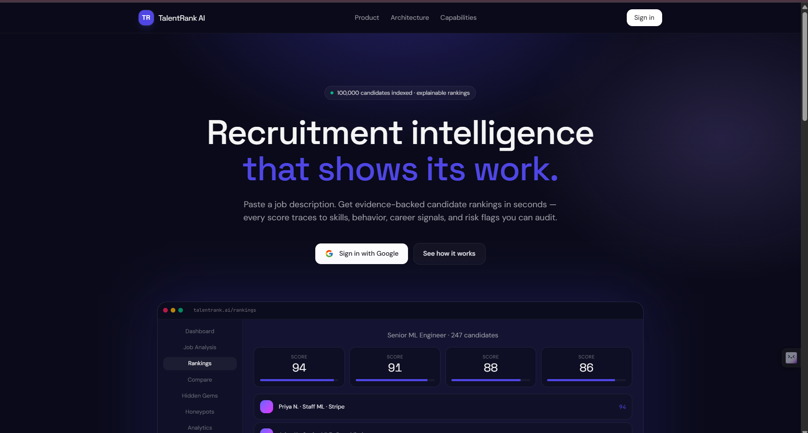
</p>

---

# 2. 🔐 Google Sign-In Page

Secure authentication using **Google OAuth** enables recruiters to access their personalized workspace. A developer bypass option is also available for local demonstrations and testing.

<p align="center">
  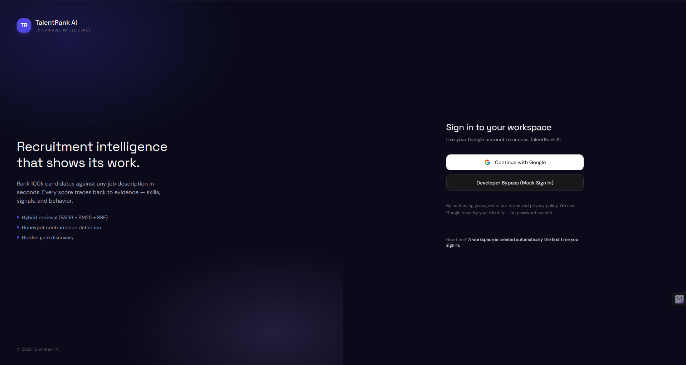
</p>

---

# 3. 📊 Dashboard

The dashboard provides a comprehensive overview of the recruitment workspace with real-time analytics and system health.

### Highlights

- 📈 Candidate statistics
- 🤖 AI indexing status
- ⚡ System performance metrics
- 📌 Recent recruitment activity
- 🚀 Quick recruiter actions
- 📊 Recruitment analytics

<p align="center">
  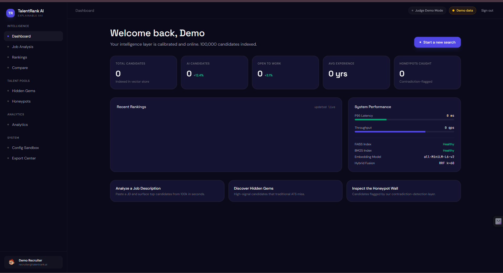
</p>

---

# 4. 📄 Job Analysis Page

Recruiters can paste any job description, and the AI pipeline automatically extracts skills, builds competency graphs, generates semantic embeddings, and retrieves the most relevant candidates.

### AI Pipeline

- Skill Extraction
- Requirement Parsing
- Semantic Embedding Generation
- Dense Vector Retrieval
- Lexical Search (BM25)
- Hybrid Ranking
- Explainable Candidate Scoring

<p align="center">
  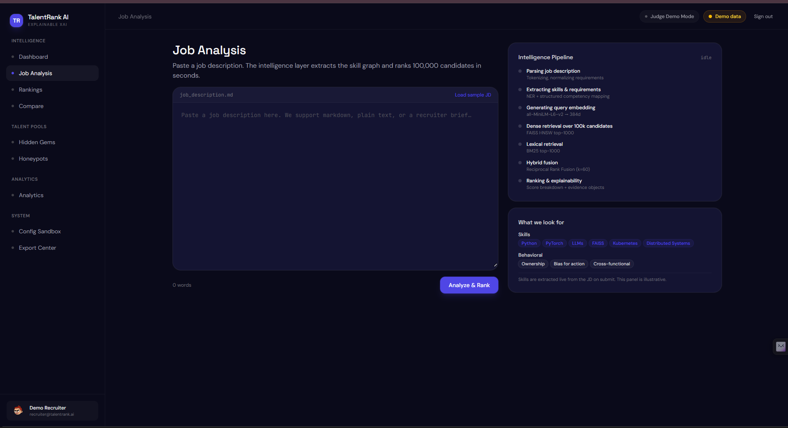
</p>

---

# 5. 🏆 Rankings Page

Displays candidates ranked using the hybrid semantic retrieval engine.

### Features

- Hybrid Semantic Search
- Confidence Scores
- Explainable AI Ranking
- Skill-based Filtering
- Candidate Search
- Fast-track Recommendations
- Resume Matching Score

<p align="center">
  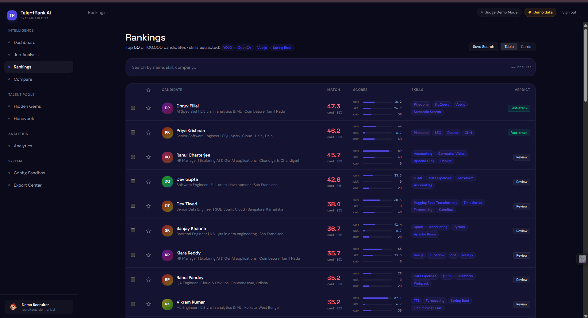
</p>

<p align="center">
  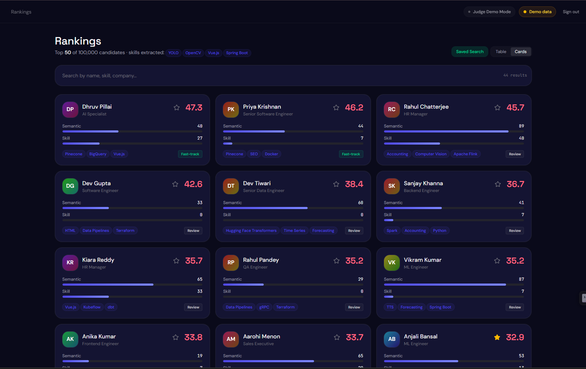
</p>

---

# 6. ⚖️ Compare Page

Compare multiple candidates side-by-side across different recruitment dimensions to support data-driven hiring decisions.

### Comparison Metrics

- Semantic Match
- Skill Score
- Career Progression
- Behavioral Fit
- Availability
- Experience
- Risk Indicators

<p align="center">
  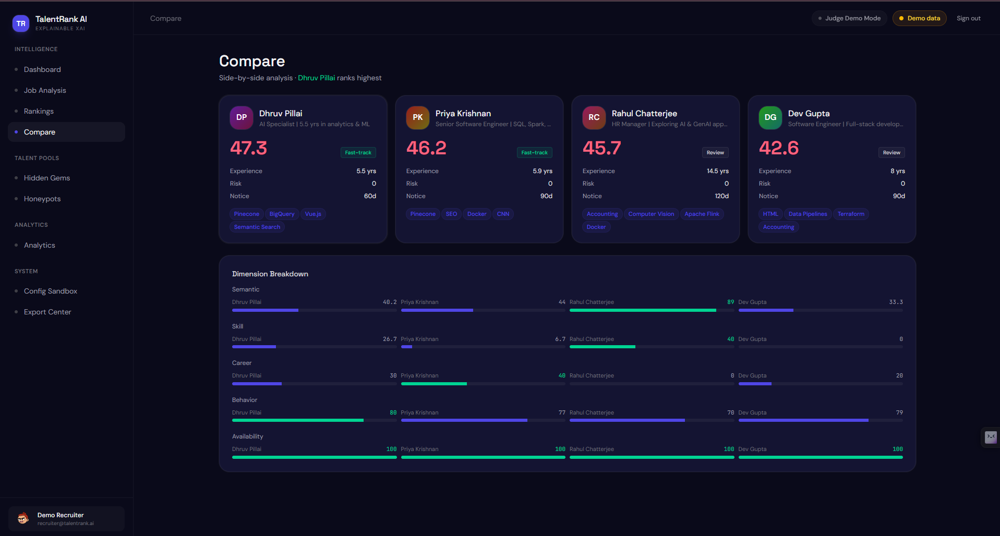
</p>

---

# 7. 🧠 Candidate Analysis Page

Every shortlisted candidate receives a fully explainable AI-generated profile with detailed competency analysis and recommendation reasoning.

### Includes

- Competency Radar Chart
- Skill Breakdown
- Career Timeline
- AI Reasoning
- Explainability Layer
- Professional History
- Recruiter Recommendation

<p align="center">
  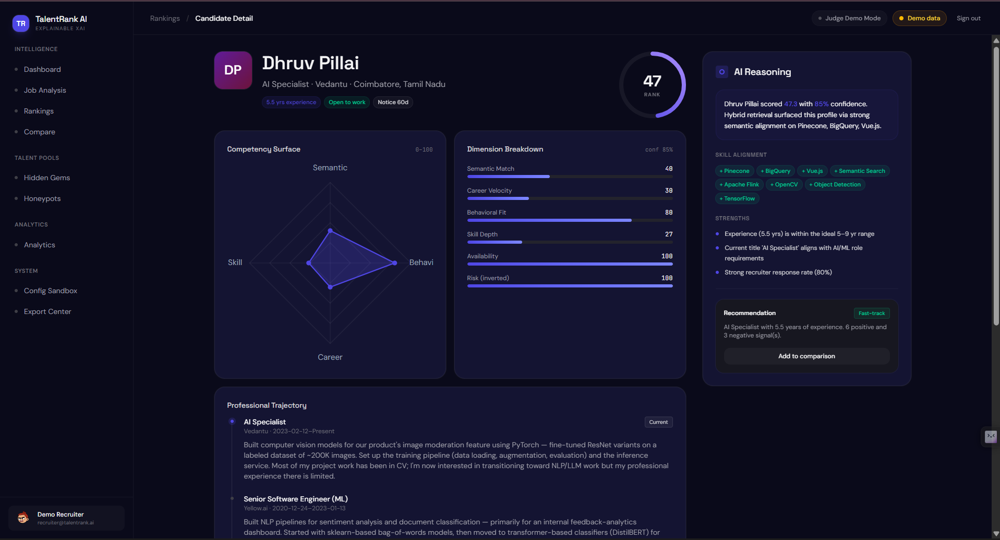
</p>

---

# 8. 💎 Hidden Gems Page

TalentRank AI discovers highly qualified candidates who are often overlooked by traditional Applicant Tracking Systems.

### Highlights

- High technical quality
- Low recruiter visibility
- AI-generated Gem Score
- Open-to-work candidates
- Intelligent talent discovery

<p align="center">
  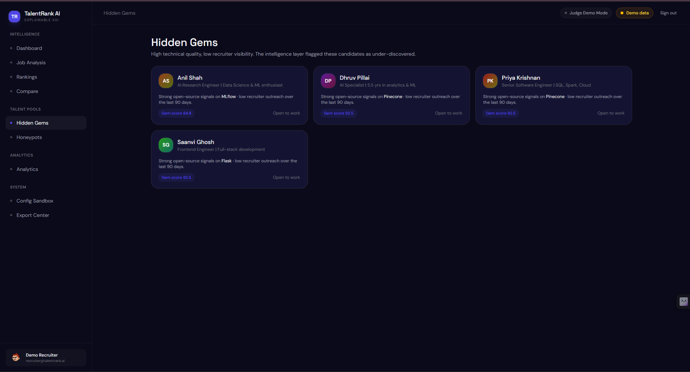
</p>

---

# 9. 🚨 Honeypots Page

The Honeypot Detection engine identifies suspicious resumes by detecting inconsistencies and contradictions within candidate profiles.

### Fraud Detection

- Resume Contradictions
- Impossible Experience Timelines
- Skill Duration Validation
- Profile Consistency Checks
- Explainable Rejection Reasons

<p align="center">
  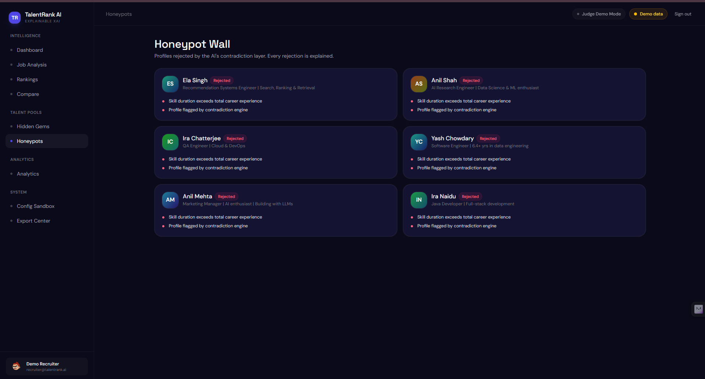
</p>

---

# 10. ⚙️ Configuration Sandbox

The **Configuration Sandbox** allows recruiters to customize the AI ranking engine by adjusting the importance of different evaluation dimensions. This enables organizations to tailor candidate rankings according to their hiring priorities.

### Features

- ⚖️ Interactive ranking weight adjustment
- 🧠 Fine-tune Semantic, Structured, Behavioral, and Recency dimensions
- 🎯 Preconfigured profiles:
  - Balanced
  - Fresher
  - Experienced
- 🚀 Real-time AI ranking customization
- 📊 Transparent scoring configuration
- 🔄 Instant application of custom ranking strategies

<p align="center">
  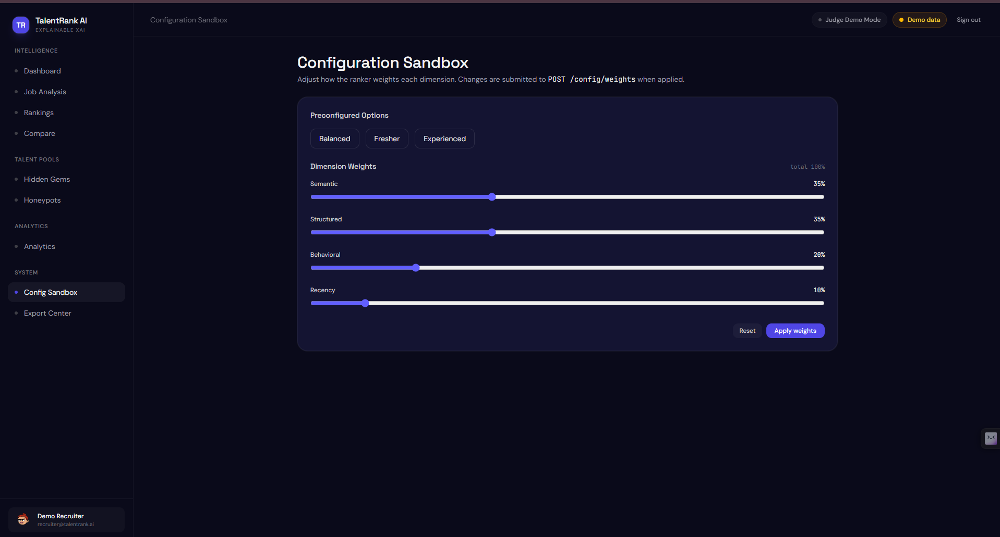
</p>

---

# 11. 📤 Export Center

The Export Center prepares shortlisted candidates for final submission and allows recruiters to export rankings in CSV format.

### Features

- CSV Export
- Submission Preview
- Candidate Validation
- Final Ranking Export
- Recruiter-friendly Output

<p align="center">
  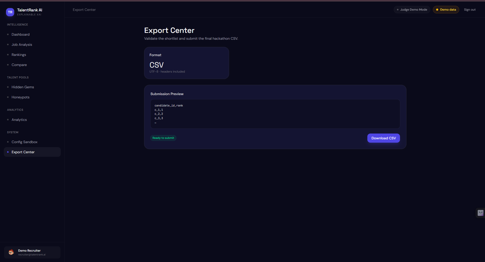
</p>

---

# 12. 👤 Recruiter Profile & Workspace

Each recruiter receives a personalized workspace that stores hiring history, saved searches, shortlisted candidates, and account information.

### Workspace Features

- Recruiter Profile
- Saved Searches
- Saved Candidates
- Export History
- Notifications
- Account Settings
- Search History
- Workspace Management

<p align="center">
  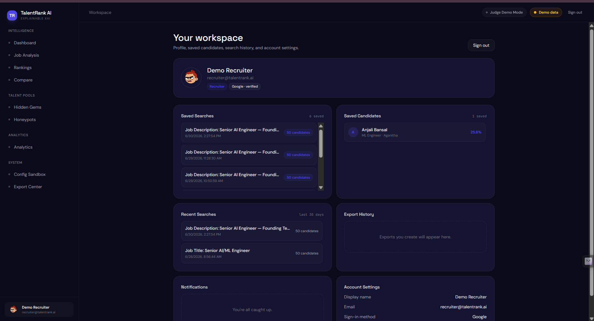
</p>

---

## ✨ User Experience Highlights

TalentRank AI is designed with a recruiter-first philosophy and combines modern UI/UX with state-of-the-art AI technologies.

### Core Highlights

- 🌙 Modern Dark Theme
- 🤖 Explainable AI (XAI)
- 🔍 Hybrid Semantic Search
- 📊 Interactive Analytics Dashboard
- ⚖️ Candidate Comparison
- 🧠 AI-Powered Candidate Analysis
- 💎 Hidden Talent Discovery
- 🚨 Resume Fraud Detection
- ⚙️ Configurable Ranking Engine
- 📤 Export-ready Recruitment Pipeline
- 📱 Responsive Enterprise-grade Interface
- 🚀 Optimized for Large-scale Candidate Search (100,000+ Profiles)
